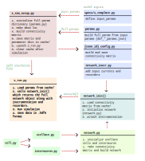

=================
Project Structure
=================

Simulation setup
----------------
Simulations are initiated by executing either ``s_sim_setup.py`` or ``m_sim_setup.py``. 
These setup scripts require a specifications file (for example ``specs/s_template.py``) as their first argument and can 
run a single simulation or multiple simulations. The diagram below illustrates a possible sequence of steps when executing ``s_sim_setup.py``.

.. image:: ./workflow.svg
  :width: 720
  :alt: Simulation Workflow
  :class: only-light

The ``specs`` file is a simple python file that defines a function ``generate_input_params()``. This function returns a
dictionary ``input_params`` that contains a subset of parameters that overrides the default parameters to run the simulation. Each
input_params must have a ``sim_id`` parameter that is used to label the data.

.. code-block:: python
    :caption: Example input_params
    :linenos:
    :emphasize-lines: 8

    def generate_input_params()-> dict:
        """Generates a dictionary of input parameters for a simulation.

        """
        sim_dur=12000 #in ms
        input_params = {   
            "sim_dur": sim_dur,
            "sim_id": "BaseModel", #Important. This is used to save the simulation data
            "init_noise_seed":np.random.randint(0,100000),
            "stell_const_dc":[-2e-3,-7e-3],
            "show_progress_bar":True,
            "n_cpus":40, #all avail

        }
        return input_params

``s_run.py`` is the main simulation file for single simulations. It loads a params file from ``cache/params_{sim_id}.json`` and calls
``network_init(params)``. ``network_init(params)`` returns the full network object along with all the
instrumentations describing inputs to the network as well as recorders for variables described in params. 

Once the network object is initialized, the simulation runs, and the data is saved in the ``.hdf5`` format. By default, 
the data is stored in the ``data/`` directory at the project root, but this location can be modified by changing the ``data_root``
parameter. Within the .hdf5 file, data is stored in the group ``{sim_num}_{data_id}``.

The dataset's shape is *num_cells × time (ms)*, where num_cells varies based on the cell type, and the time dimension depends 
on the ``recorder_dt`` parameter (default = 1 ms).

``param.py`` defines a dictionary-like Param or mParam object. When initialized these dictionaries load and combine default 
parameters from ``default_model_params.json`` and ``default_sim_params.json`` into a single Param object. The Param class 
also includes a method ``.update_params(input_params)`` that takes a subset of parameters from input_params and overrides
the default parameters in that instance. This subset is defined in the ``specs`` file 

``s_sim_setup.py`` loads the input_params from specs file that is passed to it. It initializes Param and calls 
``.update_params(input_params)``. This full param dictionary is saved as ``cache/params_{sim_id}.json``. 
It then creates the data directory ``data/{sim_id}``. If ``build_conn_matrix`` is set to ``True``, ``s_sim_setup.py`` will 
build the connectivity matrix by running the appropriate config file. These config files define a particular connectivity 
matrix and are stored in ``network_configs/connections/``. Once the matrix is built the ``.hdf5`` file with the synaptic 
weights are stored in ``cache/matrix_{conn_id}_{sim_id}``. Therefore before ``s_run.py`` is called a params .json file 
and the connectivity matrix is expected in the ``cache/``
directory.

.. note::
    If building the matrix for every simulation is unnecessary—such as when focusing on intrinsic cellular properties 
    and the synaptic connectivity remains unchanged across simulations—you can use a saved matrix and skip the build process. 
    ``network_init(params)`` looks for these in ``network_configs/connections/saved_matrices/matrix_{conn_id}_{matrix_id}.hdf5``

Once the simulation is completed i.e ``s_run.py`` ends successfully, cache files are cleared. ``s_sim_setup.py`` also saves the modified Params in ``data/{sim_id}/{sim_id}.json`` 
and the specs file as ``data/{sim_id}/{sim_id}.py`` for future reference and reproducibiltiy.

.. tip::

    You can save simulation specific information as comments in specs file. This can be helpful in documenting the purpose of simulation for future reference.

Network Intitialization
^^^^^^^^^^^^^^^^^^^^^^^

``network_init(params)`` called by ``s_run.py`` loads the matrix and params file from ``cache/``. These are then passed on to the ``Network()`` to initialize the network.
The Network class initializes the cells (from ``stellate.py`` and ``interneuron.py``) and connects them based on the connectivity defined in the adjacency matrix.
Once the network object is returned ``network_init(params)`` passes the network to ``setup_instrumentation(network)`` located in 
``network_configs.instrumentations.{instr_id}_instr.py``. This function adds input instrumentation (DC inputs, variable velocity, pulse inputs, etc.). It also sets
NEURON'S global and range variables and adds recorders to record spikes, MP, currents, conductances etc.

Multiple simulations
^^^^^^^^^^^^^^^^^^^^
Multiple simulations are initiated with ``m_sim_setup.py``. The key differences with single sim is:

* **Specs file** generates a dictionary of dictionaries with the keys for the outer dimension as simulation numbers. 
  Specifying the simulation loops explicitly keeps parameter manipulations clear and readable. Each simulation loops
  should contain a unique sim_num

  .. code-block:: python
      :caption: Parmeter dictionary for multiple simulations

      {"0": {"N_stell":384,..},
       "1": {"N_stell":384,..},
       ...
      }

  .. code-block:: python
      :caption: Example mult_input_params
      :linenos:
      :emphasize-lines: 19

      def generate_mult_input_params()-> dict:
          """Generates a dictionary of multiple input parameters

          Used for multiple simulations. Each input_params dictionary should contain 
          a unique sim_num.
          
          Returns:
              dict: A dictionary of all input parameters
          """
          sim_dur=200 #in ms
          mult_input_params = {}
          for sim_num in range(3):
              input_params = {
                  "sim_dur": sim_dur,
                  "N_intrnrn": 196,
                  "N_stell": int(196*2),
                  "N_per_sheet": 196,
                  "sim_id": "mBaseModel",  #Important. Used to save the simulation data
                  "sim_num":str(sim_num)  #Important!.
                                          # Assign a simulation number to every simulation

              }
              mult_input_params[str(sim_num)] = input_params #Important.
          return mult_input_params

* ``m_run.py`` is called instead of ``s_run.py``. **Connectivity matrix** is built in ``m_run.py`` at the start of every simulation,
  although this behaviour can be turned off.
  
    

